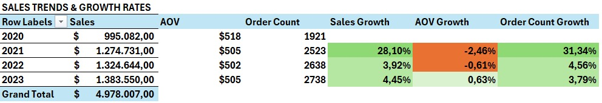
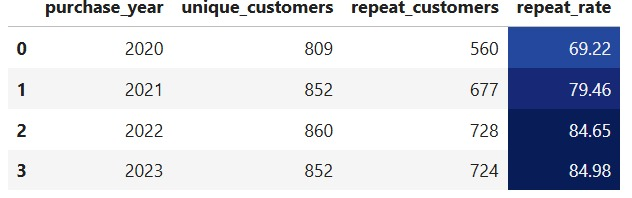

# Introduction

## Tujuan
Tujuan dari proyek ini adalah untuk menganalisis data penjualan TechHub pada periode 2020-2023, dengan fokus utama pada identifikasi tren penjualan, evaluasi kinerja produk di berbagai wilayah, serta analisis perilaku pelanggan dan saluran penjualan yang digunakan. Dengan menggali informasi lebih dalam pada area-area ini, proyek ini bertujuan memberikan TechHub wawasan yang dapat diimplementasikan untuk mengoptimalkan penawaran produk, meningkatkan keterlibatan pelanggan melalui program loyalitas, dan memperbaiki strategi pemasaran demi mencapai pertumbuhan penjualan yang berkelanjutan.

## Dataset
Pengerjaan projek ini menggunakan satu jenis dataset:
- **order_data.csv**: Dataset ini mencakup catatan pesanan individual, waktu pembelian, detail produk, informasi pelanggan, serta status pesanan. Dataset ini memberikan data yang diperlukan untuk menganalisis tren penjualan dan loyalitas pelanggan.

# Sales Trends and Growth Rates

- **TechHub** berhasil mencatat rata-rata penjualan tahunan sebesar $2,4 juta dengan 2.400 pesanan setiap tahun.
- Penjualan mengalami lonjakan signifikan pada tahun 2021 pasca pandemi, diikuti dengan peningkatan bertahap sepanjang tahun 2022 dan 2023.
- Pola musiman terlihat pada penjualan TechHub, dengan puncak tertinggi terjadi pada bulan Januari dan penurunan penjualan paling rendah di bulan September.
- Tiga negara penyumbang pendapatan terbesar adalah Jepang, Brasil, dan India.
- Amerika mencatat pertumbuhan yang mengesankan sebesar +41% pada tahun 2021, meskipun tetap menunjukkan pola yang fluktuatif.

## Key Product Performance

- Empat produk teratas yang memberikan kontribusi terbesar terhadap pendapatan adalah Smart TV, Streaming Microphone, Security Camera, dan Mini Projector, yang bersama-sama menyumbang 14,44% dari total pendapatan.
- **Security Camera** merupakan produk dengan jumlah pesanan terbanyak (pendapatan $179 ribu), meskipun tidak menjadi penyumbang pendapatan terbesar. Hal ini kemungkinan disebabkan oleh harga yang lebih rendah atau tingginya biaya promosi.
- **Smart TV** mendominasi pendapatan, dengan total kontribusi sebesar $181 ribu antara tahun 2020 hingga 2023.

## Customer Growth and Repeat Purchase Trends

- Pelanggan baru TechHub mengalami peningkatan yang konsisten setiap tahunnya, dengan jumlah pelanggan meningkat dari 809 hingga 852, dengan puncaknya pada tahun 2022 mencapai 860 pelanggan.
- Tingkat pembelian ulang menunjukkan kenaikan yang signifikan dari tahun ke tahun, dengan lonjakan terbesar terjadi pada tahun 2023, mencapai 84,98%. Hal ini mencerminkan keberhasilan TechHub dalam mempertahankan pelanggan setelah pembelian pertama.
- Stabilitas jumlah pelanggan yang melakukan pembelian ulang menunjukkan adanya basis pelanggan setia yang terus melakukan pembelian berulang setiap tahunnya.
- Peningkatan jumlah pelanggan baru pada tahun 2021 menyoroti adanya kemungkinan perubahan dinamika pasar dan preferensi pengguna setelah pandemi.

## Loyalty Program Performance

- Rata-rata waktu pembelian pertama antara anggota loyalitas dan non-loyalitas adalah 59 hari, yang menunjukkan tidak ada perbedaan signifikan.
- Setelah pandemi pada tahun 2021, jumlah anggota loyalitas meningkat pesat sebesar 26,82%. Namun, pada tahun 2022, peningkatan tersebut mengalami penurunan signifikan, hanya tumbuh 4,38% dibandingkan tahun sebelumnya, dan tren penurunan ini berlanjut pada tahun 2023.
- Saat ini, anggota loyalitas menunjukkan performa unggul dalam metrik utama, menghasilkan lebih dari $5.000 pendapatan tambahan, melakukan 28 pesanan lebih banyak, namun dengan pengeluaran yang lebih rendah ($5 lebih sedikit) dibandingkan anggota non-loyalitas.
- Program loyalitas menunjukkan kinerja yang kuat di beberapa negara, dengan kontribusi pendapatan anggota loyalitas sebesar 50,86% dan AOV $518,28 di Kanada (CA), serta 53,37% dan AOV $517,35 di Amerika Serikat (US).
- Di sisi lain, Brasil (BR) mencatat kontribusi pendapatan anggota loyalitas sebesar 49,58%, namun AOV untuk anggota loyalitas ($490,35) lebih rendah dibandingkan dengan non-loyalitas ($517,60).
- Hasil ini menunjukkan perlunya strategi yang lebih terfokus untuk meningkatkan kinerja program loyalitas di Australia (AU), India (IN), dan Brasil (BR).

## Sales by Platforms & Channels

- **Ads** (saluran iklan) menyumbang 25,36% ($1,2 juta) dari penjualan TechHub.
- **Sosial media** menyumbang 24,52% dari penjualan.
- Sosial media memiliki nilai rata-rata pemesanan tertinggi (AOV) sebesar $513, sementara saluran iklan memiliki AOV terendah sebesar $501.
- Aplikasi mobile menghasilkan penjualan tertinggi sebesar $1,68 juta dengan AOV $505, tidak berbeda jauh dengan website ($1,65) dan aplikasi komputer ($1,64). Hal ini menunjukkan keberagaman platform yang dipakai oleh user.

# Rekomendasi

## Maksimalkan Penawaran Produk:
- **Kembangkan Kategori Produk Populer**: Fokus pada pengembangan variasi produk di kategori yang sudah terbukti populer, seperti Smart TV, Streaming Microphone, Security Camera, dan Mini Projector. Dengan menawarkan lebih banyak pilihan produk premium, TechHub dapat memenuhi kebutuhan pelanggan yang lebih beragam sekaligus meningkatkan pendapatan.
- **Optimalkan Harga untuk Produk dengan Volume Tinggi**: Meskipun Security Camera memiliki volume pesanan yang tinggi, harga yang lebih rendah membuat kontribusinya terhadap pendapatan tidak maksimal. Oleh karena itu, penting untuk meninjau ulang strategi harga atau mempertimbangkan bundling dengan produk lain yang lebih bernilai untuk meningkatkan kontribusi produk ini.

## Pertumbuhan Pelanggan dan Pembelian Berulang:
- **Dorong Pembelian Berulang**: Dengan meningkatnya pembelian berulang pada 2023, TechHub bisa memanfaatkan peluang ini dengan menawarkan lebih banyak program loyalitas atau promosi khusus untuk pelanggan setia. Memberikan diskon atau hadiah bertingkat dapat menjadi insentif yang menarik.
- **Kembangkan Basis Pelanggan Baru**: Dengan bertambahnya jumlah pelanggan baru setiap tahunnya, ada peluang untuk memperluas pasar ke wilayah berkembang seperti Jepang, Brasil, dan India. Menawarkan penawaran khusus atau kampanye iklan yang menarik dapat membantu menarik perhatian pelanggan di pasar-pasar ini.

## Program Loyalitas:
- **Prioritaskan Pertumbuhan Anggota Loyalitas**: Setelah lonjakan anggota loyalitas pada 2021, diperlukan strategi yang lebih intensif untuk mempertahankan mereka, terutama di negara-negara seperti Brasil yang AOV-nya lebih rendah. Memberikan diskon atau hadiah eksklusif bisa mendorong mereka untuk berbelanja lebih sering.
- **Tingkatkan Program Loyalitas di Beberapa Wilayah**: Di wilayah seperti Australia, India, dan Brasil, program loyalitas perlu disesuaikan agar lebih menarik dan dapat meningkatkan AOV. Meningkatkan keterlibatan pelanggan dan memberikan penawaran yang relevan di masing-masing wilayah bisa menjadi kunci untuk memperkuat program ini.

## Penjualan Berdasarkan Saluran dan Platform:
- **Optimalkan Aplikasi Mobile dan Website**: Mengingat aplikasi mobile menyumbang penjualan terbesar, sangat penting untuk terus meningkatkan pengalaman pengguna di aplikasi mobile dan website. Hal ini akan mempermudah pelanggan berbelanja dan mendorong mereka untuk meningkatkan AOV.
- **Perkuat Penggunaan Media Sosial**: Karena media sosial memiliki AOV tertinggi, TechHub bisa memperluas kampanye pemasaran melalui saluran ini. Kolaborasi dengan influencer atau kampanye berbayar bisa menjadi cara yang efektif untuk menjangkau audiens lebih luas dan meningkatkan penjualan.

## Strategi Pertumbuhan Regional:
- **Prioritaskan Pasar yang Sudah Berkembang**: Pasar seperti Amerika Utara, EMEA, dan Jepang sudah menunjukkan hasil yang positif. Oleh karena itu, TechHub bisa terus mengalokasikan sumber daya pemasaran dan produk untuk wilayah-wilayah ini agar tetap mempertahankan atau bahkan meningkatkan kinerjanya.
- **Tingkatkan Pertumbuhan di APAC dan LATAM**: Untuk pasar yang berkembang seperti APAC dan LATAM, TechHub bisa memanfaatkan kemitraan lokal dan penawaran yang lebih disesuaikan dengan budaya untuk menangkap potensi pertumbuhan di wilayah ini.

## Optimasi Saluran dan Platform:
- **Perbesar Kemitraan Afiliasi**: Meningkatkan jumlah kemitraan afiliasi atau memberikan komisi yang lebih tinggi bagi pemasar afiliasi dapat membantu memperluas jangkauan merek dan meningkatkan AOV.
- **Perbaiki Pengalaman Pengguna di Platform Digital**: Fokus untuk meningkatkan pengalaman checkout dan personalisasi baik di aplikasi mobile maupun website akan membuat pelanggan merasa lebih nyaman berbelanja, yang pada gilirannya bisa meningkatkan frekuensi pembelian mereka.
